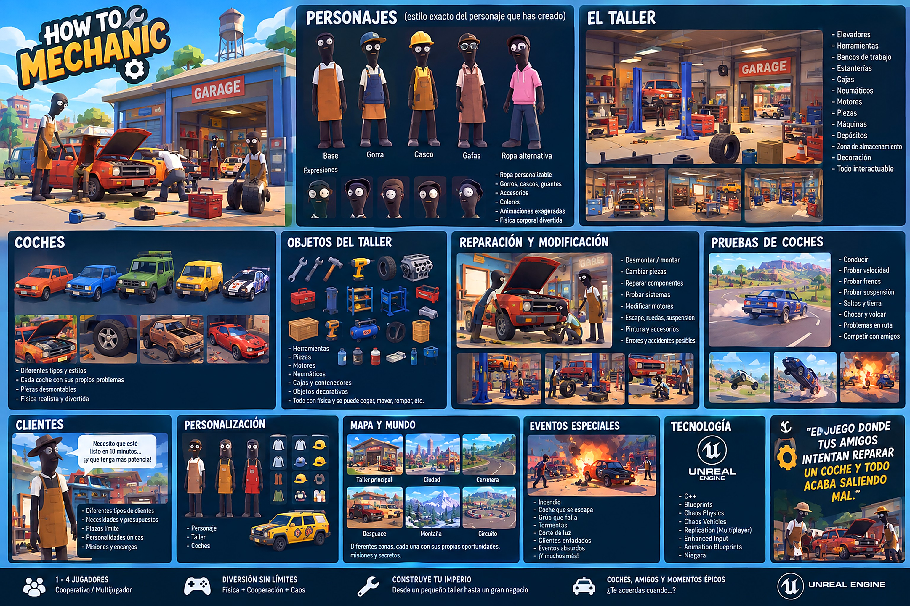

# How to Mechanic

Party game cooperativo de física para 1-4 jugadores online: un taller de coches cutre que crece hasta convertirse en
un imperio. La diversión sale de la física, de la interacción entre jugadores y de sus decisiones.



> **Estado:** el código de las fases 0-7 está escrito pero **todavía no se ha compilado ni probado** (se escribió sin
> Unreal Engine disponible). Empieza por [`docs/EDITOR_STEPS.md`](docs/EDITOR_STEPS.md). Estado detallado en
> [`docs/DEVLOG.md`](docs/DEVLOG.md).

## Requisitos

- Unreal Engine **5.4**
- Visual Studio 2022 con "Desarrollo de juegos con C++"
- Steam (solo para probar el online real; en PIE y LAN no hace falta)

## Arranque rápido

**Lo más fácil:** doble clic en `COMPILAR_Y_ABRIR.bat`. Busca Unreal 5.4, compila y abre el editor. Si falla, abre
`compilacion.txt` con los errores.

A mano:

1. Clic derecho en `HowToMechanic.uproject` → *Generate Visual Studio project files* → compila
   **Development Editor / Win64**.
2. Abre el proyecto. En el primer arranque se generan solos los datos (`DT_*`), `DA_Tuning`, los materiales y los
   mapas (`Tools/Scripts/setup_project.py`). Reinicia el editor.
3. Abre `L_Workshop` → Play (ya configurado como *listen server* con 2 jugadores).
4. Consola: `HTMHelp`.

## Controles

| Acción | Teclado / ratón | Mando |
|---|---|---|
| Moverse / cámara | WASD / ratón | stick izq. / stick der. |
| Correr · saltar | Mayús · Espacio | L3 · A |
| Agacharse · tumbarse | C · X | B · cruceta abajo |
| Coger / soltar | E | X |
| Lanzar | Q | RB |
| Usar (mantener) | clic izq. | RT |
| Uso secundario (mantener) | clic der. | LT |
| Subir / bajar del coche | F | Y |
| Gritar "¡EH!" · emote | T · G | LB · cruceta arriba |
| Conducir: acelerar · frenar · girar | W · S · A/D | RT · LT · stick izq. |
| Freno de mano · bocina | Espacio · H | A · RB |

## Estructura

```
Source/HowToMechanic/   C++ (Core, Character, Interaction, Tools, Parts, Vehicle, Economy, Customers, Progression, UI, Net)
Content/Data/           Datos de juego en JSON (fuente de los DT_*)
Content/Python/         init_unreal.py (setup automático al abrir el editor)
Tools/Scripts/          Scripts Python del editor (tablas, tuning, materiales, mapas, Blueprints)
Config/                 Motor, juego, input, editor
docs/                   GDD, dirección de arte, diseño técnico, fases, devlog, assets, pasos de editor, referencias
```

## Documentación

| Documento | Para qué |
|---|---|
| [`CLAUDE.md`](CLAUDE.md) | Reglas permanentes del proyecto |
| [`docs/GDD.md`](docs/GDD.md) | Qué es el juego |
| [`docs/ART_DIRECTION.md`](docs/ART_DIRECTION.md) | Cómo se ve |
| [`docs/TECH_DESIGN.md`](docs/TECH_DESIGN.md) | Clases, replicación, ADR-001 (vehículo) |
| [`docs/PROMPTS_POR_FASES.md`](docs/PROMPTS_POR_FASES.md) | Fases y criterios de aceptación |
| [`docs/DEVLOG.md`](docs/DEVLOG.md) | Qué se hizo, decisiones, deuda técnica |
| [`docs/ASSET_LIST.md`](docs/ASSET_LIST.md) | Placeholders y encargo de arte final |
| [`docs/EDITOR_STEPS.md`](docs/EDITOR_STEPS.md) | Lo que hay que hacer en el editor |
